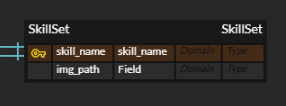

<!-- logo -->

### 포트폴리오 웹사이트 🖍️

  
  

## 개발과정 TIL(Today I Learned)

## 프로젝트를 통해 배운것

### Autoincrement의 필요성 (2024/11/29)

만약 우리가 사용하고 있는 외래 키를 직접 이름을 지을 경우, 나중에 수정이 힘들다는 것을 개발 도중 알아냈다.
이미지를 미리 저장하고 테이블에서 불러올려 했으나 생각해보니 스킬이름을 외래키로 두면 나중에 수정하면 다른테이블과의 연결이 끊기기 떄문에...

여기서 이렇게 수정했다.

## 프로젝트에 적용한 알고리즘

## 😡 기술적 이슈와 해결 과정

## 스킬 아이콘 출처

https://github.com/tandpfun/skill-icons?tab=readme-ov-file#icons-list
